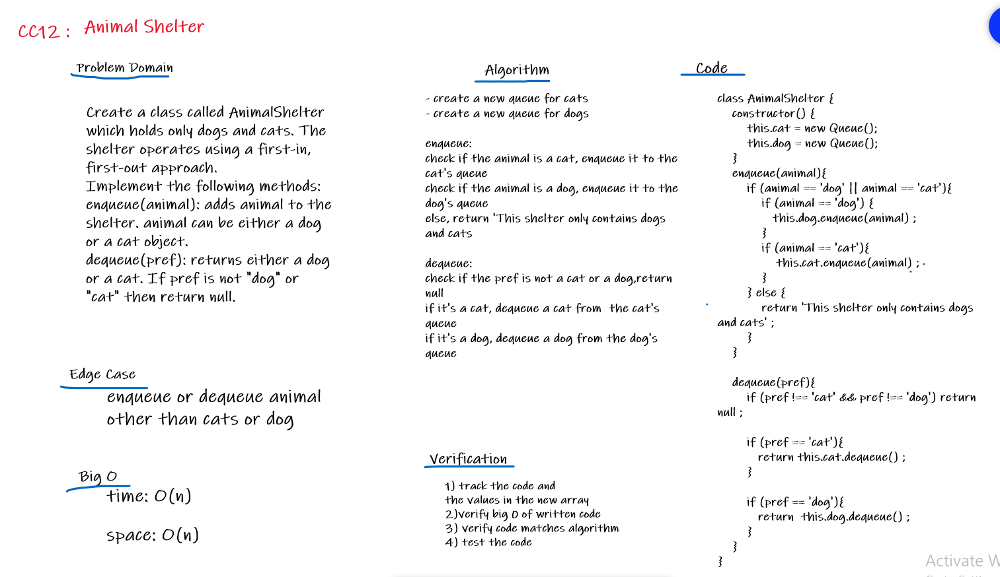

# Challenge Summary
Create a class called AnimalShelter which holds only dogs and cats. The shelter operates using a first-in, first-out approach.

## Challenge Description
Create a class called AnimalShelter which holds only dogs and cats. The shelter operates using a first-in, first-out approach.
Implement the following methods:
enqueue(animal): adds animal to the shelter. animal can be either a dog or a cat object.
dequeue(pref): returns either a dog or a cat. If pref is not "dog" or "cat" then return null.

## Approach & Efficiency
- create a new queue for cats 
- create a new queue for dogs 

enqueue:
check if the animal is a cat, enqueue it to the cat's queue
check if the animal is a dog, enqueue it to the dog's queue
else, return 'This shelter only contains dogs and cats

dequeue:
check if the pref is not a cat or a dog,return null
if it's a cat, dequeue a cat from  the cat's queue
if it's a dog, dequeue a dog from the dog's queue

### Big O
Time: O(1) 
Space: O(1)
 
## API
* enqueue: which inserts value into the animalShelter, using a first-in, first-out approach.
* dequeue: which extracts a value from the animalShelter, using a first-in, first-out approach.

## Solution
