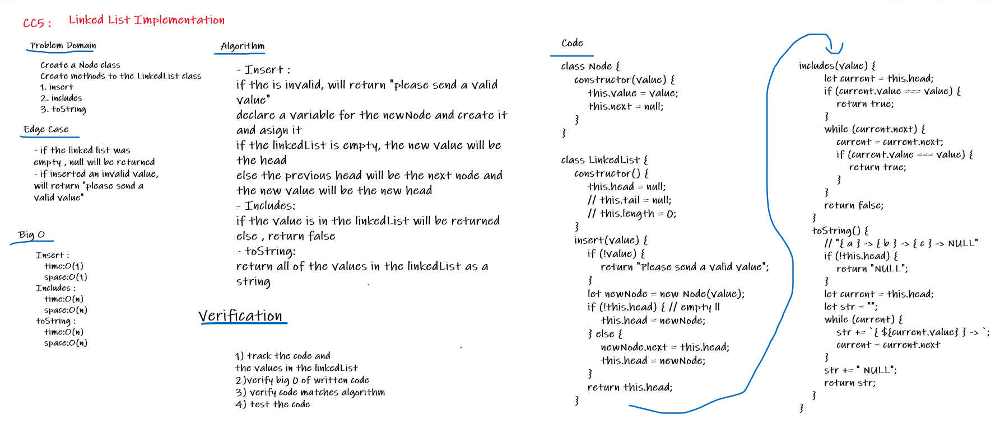

# Singly Linked List

## Methods implementation for singly linked lists.

## Challenge
* ### Create a Node class that has properties for the value stored in the Node, and a pointer to the next Node.
* ### Within your LinkedList class, include a head property. Upon instantiation, an empty Linked List should be created.
* ### Define a method called insert which takes any value as an argument and adds a new node with that value to the head of the list with an O(1) Time performance.
* ### Define a method called includes which takes any value as an argument and returns a boolean result depending on whether that value exists as a Node’s value somewhere within the list.
* ### Define a method called toString (or __str__ in Python) which takes in no arguments and returns a string representing all the values in the Linked List, formatted as: "{ a } -> { b } -> { c } -> NULL"
* ### Define a method append(value) which adds a new node with the given value to the end of the list.
* ### Define a method insertBefore(value, newVal) which add a new node with the given newValue immediately before the first value node
* ### Define a method insertAfter(value, newVal) which add a new node with the given newValue immediately after the first value node

 

## Approach & Efficiency
- ### Insert : 
#### if the is invalid, will return "please send a valid value",
#### declare a variable for the newNode and create it and asign it,
#### if the linkedList is empty, the new value will be the head,
#### else the previous head will be the next node and the new value will be the new head. 
- ### Includes: 
#### if the value is in the linkedList will be returned,
#### else , return false.
- ### toString:
#### return all of the values in the linkedList as a string.
- ### append: 
#### adds a new node with the given value to the end of the list.
- ### insertBefore:
#### add a new node with the given newValue immediately before the first value node.
- ### insertAfter:
#### add a new node with the given newValue immediately after the first value node.

### Big O :
* #### Insert : 
   ##### time:O(1)
   ##### space:O(1)
* #### Includes : 
   ##### time:O(n)
   ##### space:O(1) 
* #### toString :
   ##### time:O(n)
   ##### space:O(1) 
* #### append : 
  ##### time:O(n)
  ##### space:O(1) 
* #### insertBefore : 
  ##### time:O(n)
  ##### space:O(1) 
* #### insertAfter : 
  ##### time:O(n)
  ##### space:O(1) 

## API
- ### insert: insert node to the linked list head.
- ### includes: return true/false when finding a value within the linked list that exists/doesn't exist.
- ### toString: return a collection of all the values that exist in the linked list as a string.
- ### append: add a node/multiple nodes to the end of the linked list.
- ### insertBefore: add a new node with the given newValue immediately before the first value node.
- ### insertAfter: add a new node with the given newValue immediately after the first value node.

