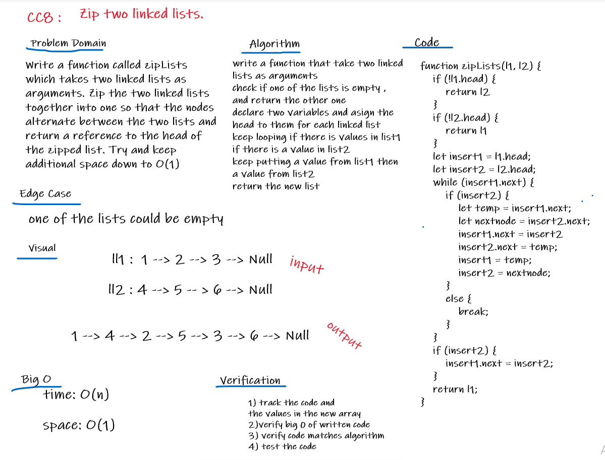

# Linked List

## Zip two linked lists together

## Challenge
* ### Write a function called zipLists which takes two linked lists as arguments. Zip the two linked lists together into one so that the nodes alternate between the two lists and return a reference to the head of the zipped list. Try and keep additional space down to O(1)

 

## Approach & Efficiency
- ### zipLists: 
#### write a function that take two linked lists as arguments
#### check if one of the lists is empty , and return the other one
#### declare two variables and asign the head to them for each linked list
#### keep looping if there is values in list1
#### if there is a value in list2
#### keep putting a value from list1 then a value from list2 
#### return the new list

### Big O :
* #### zipLists: 
   ##### time:O(n)
   ##### space:O(1)

## API
- ### zipLists: zip two linked lists together
 

