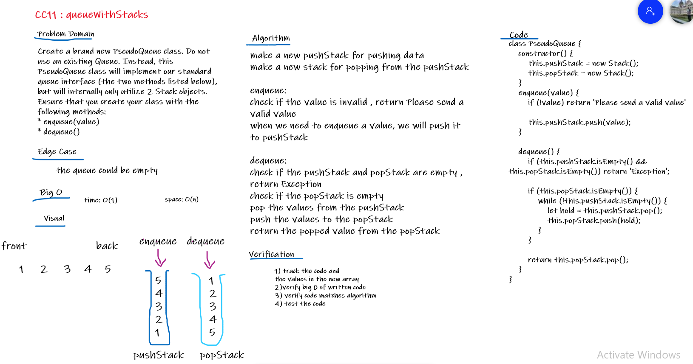

# Challenge Summary
Implement a Queue using two Stacks.

## Challenge Description
Create a brand new PseudoQueue class. Do not use an existing Queue. Instead, this PseudoQueue class will implement our standard queue interface (the two methods listed below), but will internally only utilize 2 Stack objects. Ensure that you create your class with the following methods:
* enqueue(value) which inserts value into the PseudoQueue, using a first-in, first-out approach.
* dequeue() which extracts a value from the PseudoQueue, using a first-in, first-out approach.
The Stack instances have only push, pop, and peek methods. You should use your own Stack implementation. Instantiate these Stack objects in your PseudoQueue constructor.

## Approach & Efficiency
* make a new pushStack for pushing data
* make a new stack for popping from the pushStack
 
* enqueue: 
- check if the value is invalid , return Please send a valid value
- when we need to enqueue a value, we will push it to pushStack

* dequeue: 
- check if the pushStack and popStack are empty , return Exception 
- check if the popStack is empty 
- pop the values from the pushStack 
- push the values to the popStack
- return the popped value from the popStack

### Big O
Time: O(1) 
Space: O(n)

## API
* enqueue: which inserts value into the PseudoQueue, using a first-in, first-out approach.
* dequeue: which extracts a value from the PseudoQueue, using a first-in, first-out approach.

## Solution
