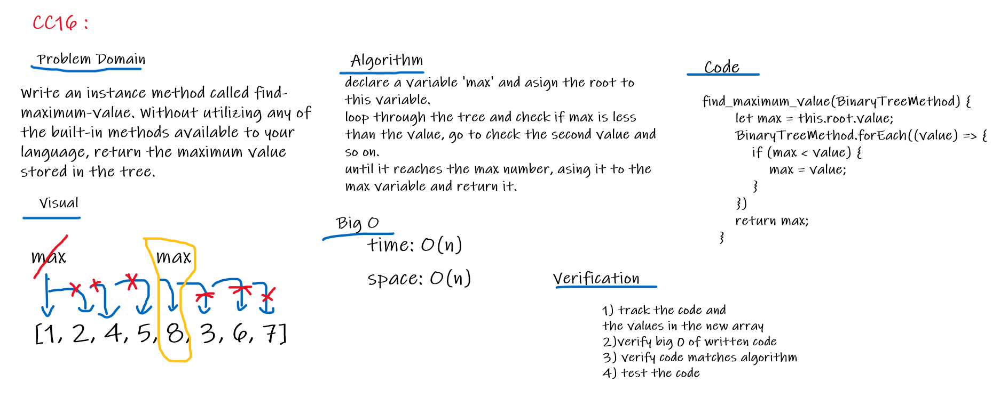
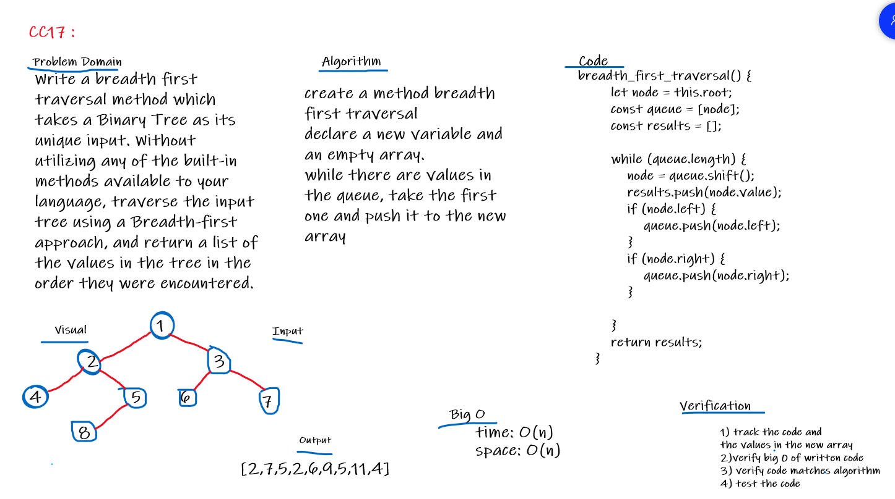

# Trees
* Create a Node class.
* Create a BinaryTree class and it's methods.
* Create a BinarySearchTree class and it's methods.

## Challenge
* Create a Node class that has properties for the value stored in the node, the left child node, and the right child node.
* Create a BinaryTree class
* Define a method for each of the depth first traversals called preOrder, inOrder, and postOrder which returns an array of the values, ordered appropriately.
* Define a method for getting the max value in the tree.
* Define a method for breadth first traversal.

* Create a BinarySearchTree class
* Define a method named add that accepts a value, and adds a new node with that value in the correct location in the binary search tree.
* Define a method named contains that accepts a value, and returns a boolean indicating whether or not the value is in the tree at least once.

## Approach & Efficiency
Binary Tree
preOrder: 
   create a new array 
   create a function that recieves a value
   push the first value (root) to the array
   then check if there is a left value , invoke the same function again and push the left value
   then check if there is a right value , invoke the same function again and push the right value
   return the array

inOrder:
   create a new array 
   create a function that recieves a value
   then check if there is a left value , invoke the same function again and push the left value
   push the root to the array
   then check if there is a right value , invoke the same function again and push the right value
   return the array

postOrder:
   create a new array 
   create a function that recieves a value
   then check if there is a left value , invoke the same function again and push the left value
   then check if there is a right value , invoke the same function again and push the right value
   push the root to the array
   return the array

find_maximum_value:
create a method find_maximum_value 
declare a variable 'max' and asign the root to this variable.
loop through the tree and check if max is less than the value, go to check the second value and so on. 
until it reaches the max number, asing it to the max variable and return it.

breadth_first_traversal:
create a method breadth first traversal
declare a new variable and an empty array.
while there are values in the queue, take the first one and push it to the new array 

Binary Search Tree
add:
  declare a node and asign the root to it
  check if the root is null , the root will be the new node
  else, declare a function for adding the left and the right node , and it will be sorted. 

contain:
  declare a variable (current) and asign the root to it.
  keep looping through all the values until it found the targeted value , return true
  if it's not in the tree, return false.

### Big O
Binary Tree
preOrder:
  Time: O(n) 
  Space: O(h)
inOrder:
  Time: O(n) 
  Space: O(h)
postOrder:
  Time: O(n) 
  Space: O(h)
find_maximum_value:
  Time: O(n) 
  Space: O(n)
breadth_first_traversal:
  Time: O(n) 
  Space: O(n)

Binary Search Tree
add:
  Time: O(log n) 
  Space: O(h)
contain:
  Time: O(log n) 
  Space: O(h)

## API
Binary Tree
preOrder: it creates a tree (Root - Left - Right)
inOrder:  it creates a tree (Left - Root - Right)
postOrder: it creates a tree (left - Right - Root)
find_maximum_value: it returns the max value from the tree. 
breadth_first_traversal: it returns a list of the values in the tree in the order they were encountered.

Binary Search Tree
add: it creates a sorted tree.
contain: it finds if a specific value is in the tree.

