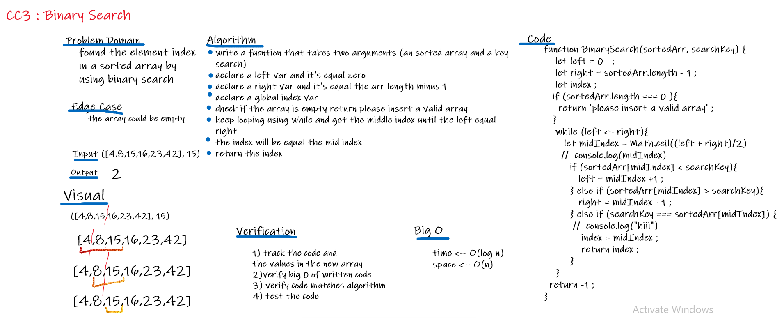

# Array Binary Search
A function called BinarySearch takes two arguments which is a sorted array and the search key. Without using any of the built-in methods in JavaScript, return the index of the array’s element that is equal to the search key, or -1 if the element does not exist using JavaScript language.

## Challenge
We have to write the function without using built-in methods and using binary search algorithm.

## Approach & Efficiency
In order to solve this problem i write a function that takes 2 arguments (an sorted array and a key search) ,also a new 3 variables declared, left var and it's equal zero, right var and it's equal the arr length minus 1 , and global index var, then checked if the array is empty it will return please insert a valid array, and if not, it will keep looping using while and get the middle index until the left equal the right, then the index will be equal the mid index and returned the index.

## Solution

## Resources and Collaboration 
pair programmed  with Afnan Damra   

[Wikipedia](https://en.wikipedia.org/wiki/Binary_search_algorithm)

