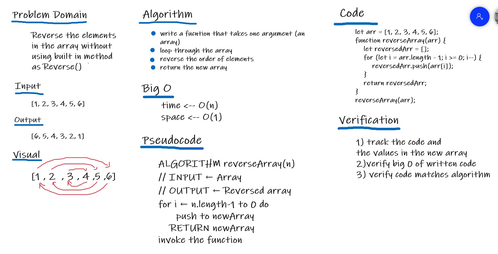

# Reverse an Array
A function called reverseArray takes an array as an argument. Without using any of the built-in methods like reverse().
and it return the elements in the array in reversed order using JavaScript language.

## Challenge
We have to write the function without using reverse()

## Approach & Efficiency
In order to solve this challenge a new empty array was created, then I looped (using for) over the original array from the highest index to the lowest one, and pushed each elemnt to the new array.

## Solution
