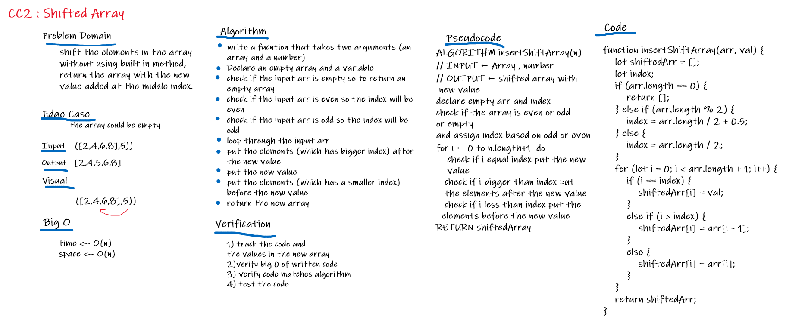

# Array Shift 
A function called insertShiftArray takes two arguments, it should return a new array with the new value added at the middle index using javaScript language, Without using any of the built-in methods. 

## Challenge
We have to write the function without using built-in methods.

## Approach & Efficiency
In order to solve this challenge a new empty array was created and a variavle, then I checked if the array is empty, odd, or even, 
and based on that, index was assigned, then looped (using for) over the original array and put the value in it's index and the elements with smaller index put before the new value and the elements with the bigger index put after the new value.

## Solution

