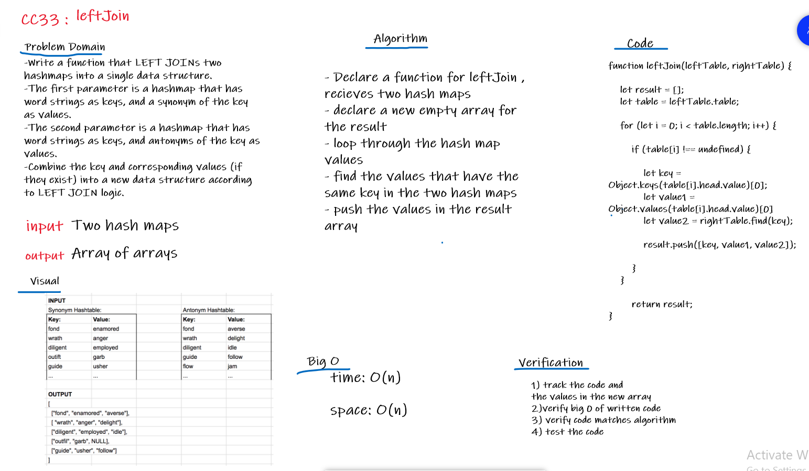

# Challenge Summary
Implement a simplified LEFT JOIN for 2 Hashmaps.

## Challenge Description
Write a function that LEFT JOINs two hashmaps into a single data structure.
The first parameter is a hashmap that has word strings as keys, and a synonym of the key as values.
The second parameter is a hashmap that has word strings as keys, and antonyms of the key as values.
Combine the key and corresponding values (if they exist) into a new data structure according to LEFT JOIN logic.

## Approach & Efficiency
- Declare a function for leftJoin , recieves two hash maps 
- declare a new empty array for the result 
- loop through the hash map values
- find the values that have the same key in the two hash maps
- push the values in the result array

### Big O
Time: O(n) 
Space: O(n)

## Solution

