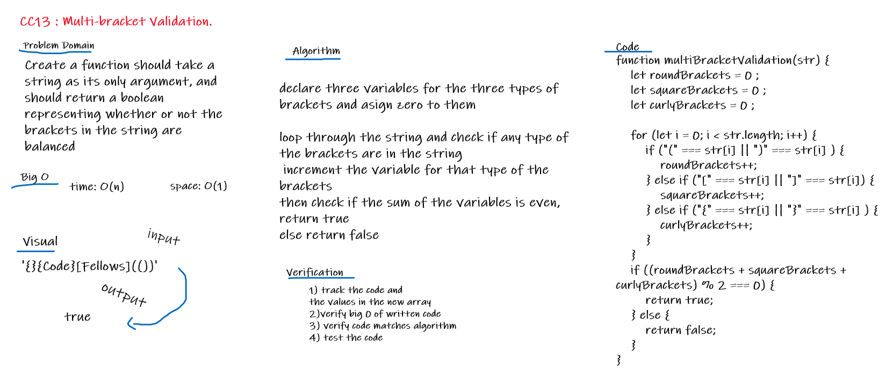

# Challenge Summary
Create a function for multi-bracket validation.

## Challenge Description
Create a function should take a string as its only argument, and should return a boolean representing whether or not the brackets in the string are balanced. There are 3 types of brackets:

Round Brackets : ()
Square Brackets : []
Curly Brackets : {}

## Approach & Efficiency
declare three variables for the three types of brackets and asign zero to them
loop through the string and check if any type of the brackets are in the string 
increment the variable for that type of the brackets 
then check if the sum of the variables is even, return true 
else return false 

### Big O
Time: O(n) 
Space: O(1)
 
## Solution
