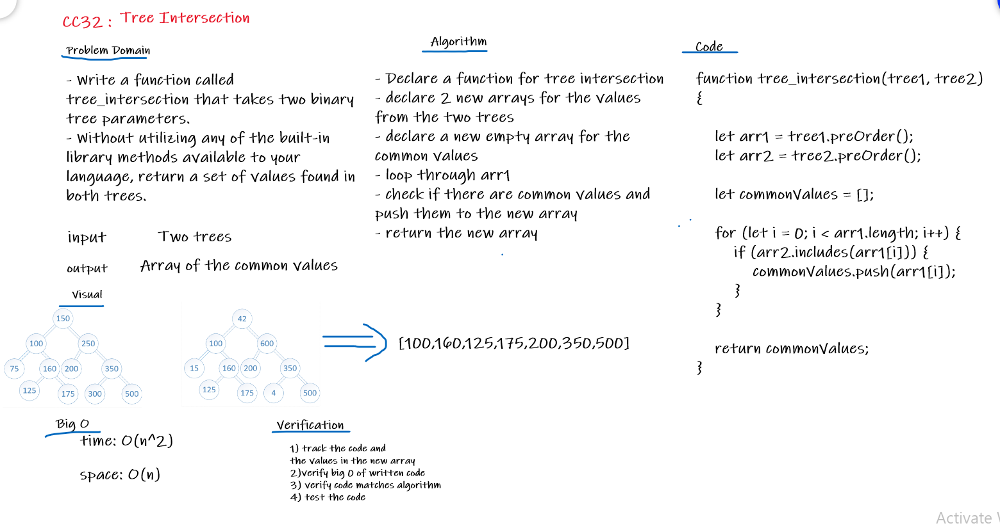

# Challenge Summary
Find common values in 2 binary trees.

## Challenge Description
- Write a function called tree_intersection that takes two binary tree parameters.
- Without utilizing any of the built-in library methods available to your language, return a set of values found in both trees.

## Approach & Efficiency
- Declare a function for tree intersection
- declare 2 new arrays for the values from the two trees
- declare a new empty array for the common values
- loop through arr1 
- check if there are common values and push them to the new array
- return the new array

### Big O
Time: O(n^2) 
Space: O(n)

## Solution

